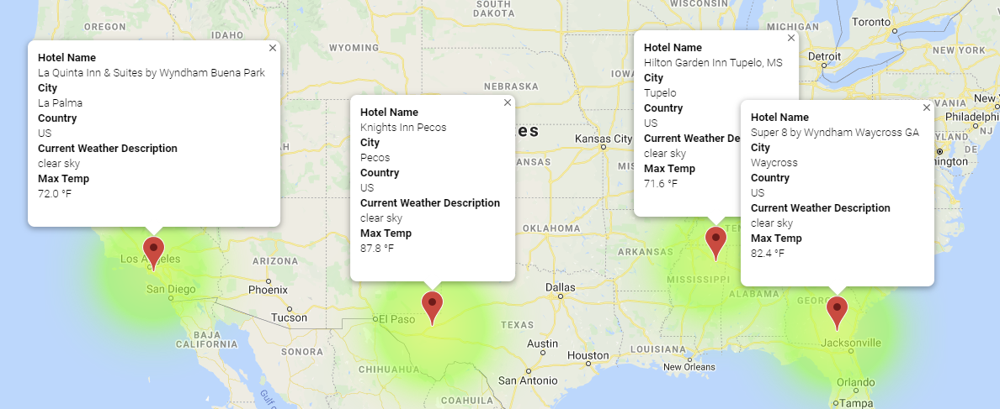

# World_Weather_Analysis
New project on world weather analysis. Making changes to the weather app.

## Project Overview
This project will be using Python, Pandas and API Keys to create a travel and destination map fuse with weather data. It has been recommended that a few changes are to me made in order to take the app to the next level. Recommendations requested specifically asks for adding the weather description to the weather data already retrieved. Afterwhich, the beta testers will use input statements to filter the data for their weather preferences, which will be used to identify potential travel destinations and nearby hotels. From the list of potential travel destinations, the beta tester will choose four cities to create a travel itinerary. Finally, using the Google Maps Directions API, a travel route will be ctreated between the four cities as well as a marker layer map. Ergo, this assignment consists of three technical deliverables. They are:

1. Retrieve Weather Data
2. Create a Customer Travel Destinations Map
3. Create a Travel Itinerary Map

Working with the `Vacation_Search_starter_code.ipynb` and the `Vacation_Itinerary_starter_code.ipynb`  starter code, Pandas `loc`, `to_numpy()`, and `concat` method will be used to find the requested results. The results will be printed to the command line and saved to three seperate folders (Weather_Database, Vacation_Search, and Vacation_Itinerary). Layered maps will be created and used to visualize the desired results.

## Purpose
The purpose of this project is launch a new product with PlanMyTrip that will deliver on all three (3) deleverables outlined.

## Resources
- **Data Source:** Vacation_Search_starter_code.ipynb, Vacation_Itinerary_starter_code.ipynb, ride_data.csv, config.py, WeatherPy_Database.csv, WeatherPy_vacation.csv
- **URL:** openweathermap, googlemaps
- **Software:** Anaconda 4.8.3, Jupyter Notebook 6.0.3, Visual Code 1.47, Python 3.7.6

## World Weather Results
>
>
### **Retrieving Weather Data Results**
>A set of 2,000 random latitudes and longitudes was generated, the nearest city retrieved, and an API call was performed with the OpenWeatherMap. In addition to the city weather data gathered, API keys was used to retrieve the current weather description for each city. Last, a new DataFrame was created  containing the updated weather data. Below is a preview of the dataframe: 
>
>**DataFrame containing the updated weather data from the terminal:**
>
>
>
### **Customer Travel Destinations Results**
>Input statements was used to retrieve customer weather preferences, then those preferences was used to identify potential travel destinations and nearby hotels. Later, those destinations were shown on a marker layer map with pop-up markers. The weather preferences chosen are as follows: 
>- Minimum temperature criteria for your vaction: `65`
>- Maximum temperature criteria for your vaction: `95`
>
>**A marker layer map showing destinations with pop-up markers:**
>
>
>
>
### **Vacation Itinerary Results**
>Google Directions API was used to create a travel itinerary that shows the route between four cities chosen from the customer’s possible travel destinations. Then, a marker layer map was created with a pop-up marker for each city on the itinerary. The four cities chosen are as follows: 
>- Tupelo: {Country: US}
>- La Palma: {Country: US}
>- Pecos: {Country: US}
>- Waycross: {Country: US}
>
>
>**A direction layer map using the start and end latitude-longitude pair:**
>
>
>
>**A direction layer map with the weather description and maximum temperature for the city:**
>
>